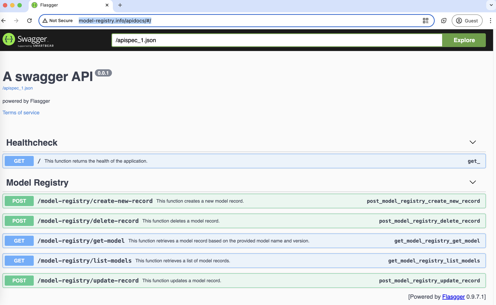
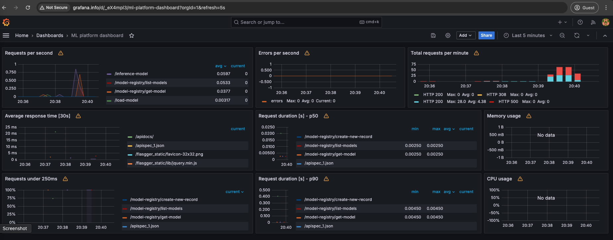

## About The Project

This is a basic ML platform that has model registry and inference server components. It also has monitoring and logging infrastructure. The tech stack is listed below:

- [Minikube](https://minikube.sigs.k8s.io/)
- [Docker Compose](https://docs.docker.com/compose/)
- [Flask](https://flask.palletsprojects.com/en/3.0.x/)
- [MongoDB](https://www.mongodb.com/)
- [Prometheus](https://prometheus.io/)
- [Grafana](https://grafana.com/)

## Getting Started

These are instructions on setting up the project locally. To get a local copy up and running follow these steps.

### Prerequisites

The project runs on the local minikube cluster, and MongoDB runs on Docker Compose. So, these two infrastructures should be running locally.
If minikube is not running, this is the command to start:

* minikube
  ```sh
  minikube start
  ```
(If minikube is started first time, "docker context use default" command should also be run to set docker CLI context.)

### Building

* First step is cloning the project :
  ```sh
  git clone https://github.com/koseemre/mlplatform.git
  ```

* The project uses some local directories for storing models, logs and mongodb data. So, the script below creates directories and mounts them to minikube cluster.\
**!! REMINDER: Minikube mount command must stay alive in the command line !!**\
Open new command prompt (in the project directory) and run: 
  ```sh
  sh create_and_mount_directory.sh
  ```
  \
**!! REMINDER for WINDOWS:** Mounting in Windows raise exception because of folder format, so last command of the script must be run manually like ->  minikube mount C:\\\Users\\\xyz...\\\data:/data

* All the deployment stuff, including building docker images, running unit tests, and then, for K8s, building deployment, creating services, and ingresses, is done by the command below:
  ```sh
  sh create_mlplatform_deployment.sh
  ```

* At last, there are two main steps to access services by DNS. Firstly, ingress host names should be added to **/etc/hosts** file of local computer.\
If OS is MacOS, add these two lines to end:\
\
127.0.0.1 inference-server.info\
127.0.0.1 model-registry.info\
127.0.0.1 grafana.info\
\
If OS is Linux, first check external minikube ip by **minikube ip** command and set these ones using your minikube ip:\
\
{minikube_ip_here} inference-server.info\
{minikube_ip_here} model-registry.info\
{minikube_ip_here} grafana.info\
\
After these settings, another alive command prompt should be needed to run commands below:(tunnel command must stay open to access by DNS)

  ```sh
  minikube addons enable ingress

  minikube tunnel
  ```

This was the final step to be able to use the ml platform.

## APIs

Note: The drive folder below includes two models and postman collection to test easily.\
**Link:** https://drive.google.com/drive/folders/1LKf44E4tmBIZe8Qczx_8BLHatJIjACqG?usp=sharing

Both model registry and inference server applications has their own Swaggers. These endpoints are:
* http://model-registry.info/apidocs
* http://inference-server.info/apidocs

For example, model registry application's swagger looks like below:



### Model Registry
* **Create Model Record** ( /model-registry/create-new-record )

It takes two parameters, meta_data field as text and model file itself.\
meta_data example:
  ```json
{
  "model_name": "diabetes_decision_tree_regressor",
  "model_class_name": null,
  "model_type": "decision_tree_regressor",
  "version": 2,
  "feature_list": ["age","sex","bmi","bp","s1","s2","s3","s4","s5","s6"],
  "owner_id": 123456,
  "location": "file_system"
}
  ```
 Api looks like below in swagger:

  

Update, get, delete and list APIs also documented in swagger.

### Inference Server

* **Loading Model**  ( /load-model )\
It takes model_name and version parameters in json format:
```json
{
    "model_name": "diabetes_decision_tree_regressor",
    "version": 1
}
```
* **Predict Result**  ( /inference-model )\
It takes model_name and version parameters in json format:
```json
{
    "input_type": "numpy_array",
    "input": [[0.01991321417832592,0.05068011873981862,0.10480868947391528,0.07007229917592636,-0.035967781275239266,-0.02667890283117104,-0.024992656631590206,-0.002592261998183278,0.0037090603325595967,0.040343371647878594]]
}
```


## Monitoring
The project uses **Prometheus** to collect applications' metrics and **Grafana** to visualize them.
There is a default dashboard like below and can be accessed from http://grafana.info after building steps are done:
(username:admin, password:admin)

